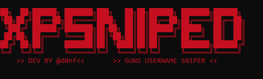

# guns.lol checker

<p align="center">
  
</p>
A simple, fast, and multi-threaded username checker for guns.lol.

Dev: d0nf

## Features
- Fast checking with threading
- Sends available names to a Discord webhook
- Avoids checking the same username twice
- Handles rate limits automatically

## Install
Install the required packages first:
```bash
pip install -r requirements.txt
```

## Run
Start the script:
```bash
python xpsniper.py
```
Then just answer the prompts in the terminal to set your webhook, username length, and how many you want to generate.

Note : I'm just a small developer, don't attack me if there are errors and bugs pls (PS: I'm not English, I tried to translate the tool but I don't think it's quite right)
